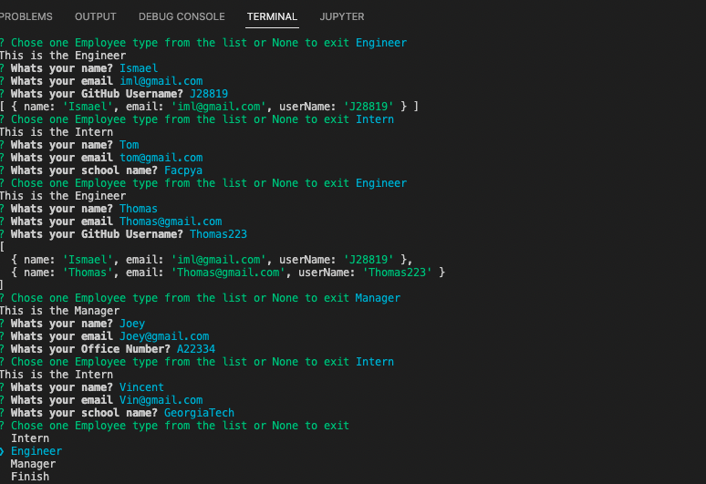
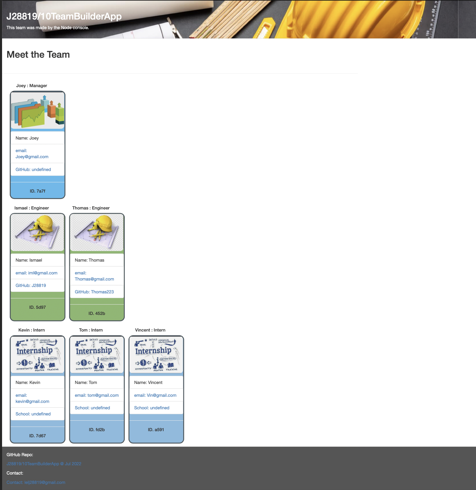

# 10TeamBuilderApp
Team Builder Application Adding Employees Roles and Functions with cards


## Locations 

Node index.js => needs to run first then, that will generate the index.html file in the public folder

## Installation

1. To clone the repository in your computer run this command.

```bash
git clone https://github.com/J28819/10TeamBuilderApp
//go to the foler
npm init
node index.js

```

2. Then open it with Visual Code and run Live Server on the [index.html file.]

3. This Page dont run in GitHub Pages, and implementation in Heroku will be in place in the future


## Description

- This Application create an index.html file with all the team members that were feeded from the Node console. 
- The Application can create N number of employeed with different clases such as Manager, Engineer or Intern.
- Each one of those employes has different attributes like Office Number, Github Link and School for Interns.
- The application has Validation in the questions to be sure they dont left empty spaces and feed all the important information.
- After all the employees are typed in the console then press Finish in the list selection to create an HTML file and run the Express server to you can see the index.html with all the Employeed in the Team


## Acceptance Criteria

```md
GIVEN a command-line application that accepts user input
WHEN I am prompted for my team members and their information
THEN an HTML file is generated that displays a nicely formatted team roster based on user input
WHEN I click on an email address in the HTML
THEN my default email program opens and populates the TO field of the email with the address
WHEN I click on the GitHub username
THEN that GitHub profile opens in a new tab
WHEN I start the application
THEN I am prompted to enter the team manager’s name, employee ID, email address, and office number
WHEN I enter the team manager’s name, employee ID, email address, and office number
THEN I am presented with a menu with the option to add an engineer or an intern or to finish building my team
WHEN I select the engineer option
THEN I am prompted to enter the engineer’s name, ID, email, and GitHub username, and I am taken back to the menu
WHEN I select the intern option
THEN I am prompted to enter the intern’s name, ID, email, and school, and I am taken back to the menu
WHEN I decide to finish building my team
THEN I exit the application, and the HTML is generated
```


## Screenshoots
Overview


Overview2


## Video Demostration

https://drive.google.com/file/d/13lpg0FizwfuMKIiFABnp86WQGwUeR-RH/view Test Application

https://drive.google.com/file/d/1lsaFVBeLZlBZX6vOG_4pJHjHQpDum15D/view Application Demostration part 1


https://drive.google.com/file/d/1RendF_7RsXmOiki6qGra9JPUSqyv4QE4/view Application Demostration part 2


## Conclusion 

 Thank you to all the GTBootcamp staff for all the support and teaching that makes this possible.


## License
[MIT](https://choosealicense.com/licenses/mit/)


